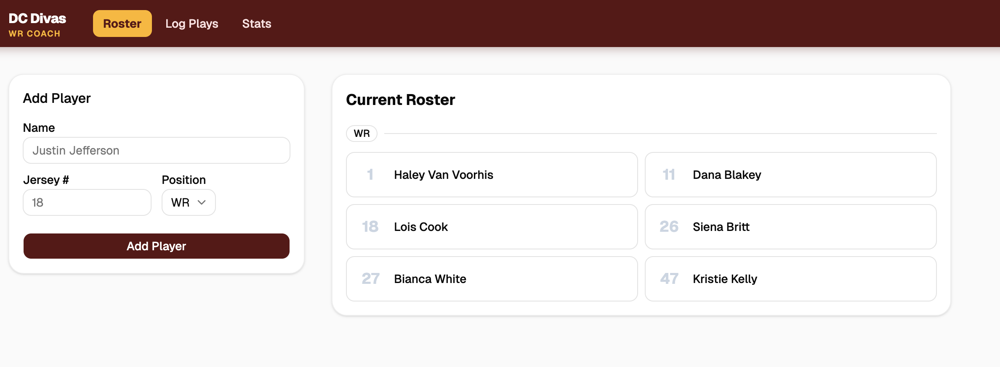
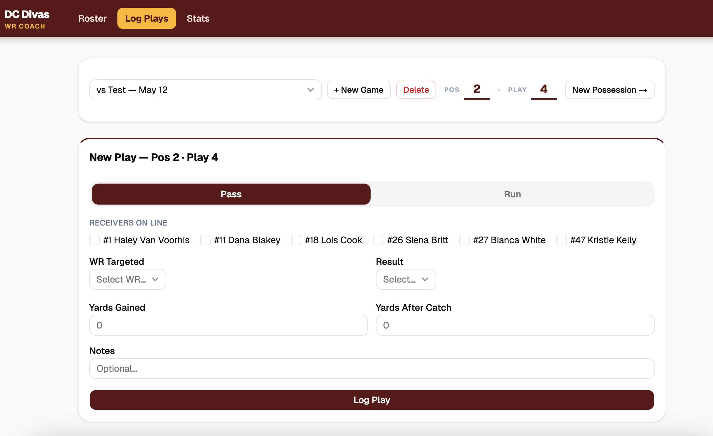
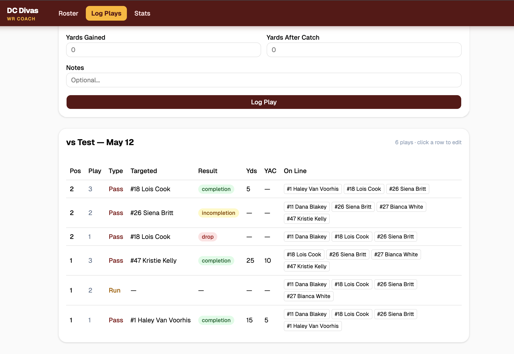

# DC Divas — WR Coach

Play-by-play film review tool for the DC Divas wide receiver coaching staff. Log plays during film sessions, track receiver usage, and visualize per-player stats across games.

## Screenshots

### Roster
Manage the player roster with jersey numbers and positions.



### Log Plays
Select a game, set the possession and play number, then log each play — receivers on the line, play type, target, result, yards, and YAC. Rows appear instantly below and can be clicked to edit.





## Features

- **Game management** — create games by opponent and date, switch between them, delete with confirmation
- **Play logging** — possession and play auto-increment; editable counters; click any row to edit in place
- **Receiver tracking** — check which receivers are on the line per play; WR targeted dropdown filters to only those receivers
- **Results** — completion, drop, incompletion, turnover; yards gained and yards after catch
- **Stats** — per-player target distribution, receiving yards, efficiency metrics, and a radar comparison chart

## Stack

- [Next.js](https://nextjs.org) (App Router)
- [Supabase](https://supabase.com) (Postgres + RLS)
- [shadcn/ui](https://ui.shadcn.com) + Tailwind CSS v4
- [Recharts](https://recharts.org) for stats visualization

## Local Development

1. Clone the repo and install dependencies:

```bash
npm install
```

2. Create a `.env.local` file with your Supabase credentials:

```bash
NEXT_PUBLIC_SUPABASE_URL=your-project-url
NEXT_PUBLIC_SUPABASE_PUBLISHABLE_KEY=your-publishable-key
```

3. Run the dev server:

```bash
npm run dev
```

Open [http://localhost:3000](http://localhost:3000) to see the app.

## Database

The schema is in [`supabase/schema.sql`](./supabase/schema.sql). Run it in the Supabase SQL editor to create the tables and RLS policies.
